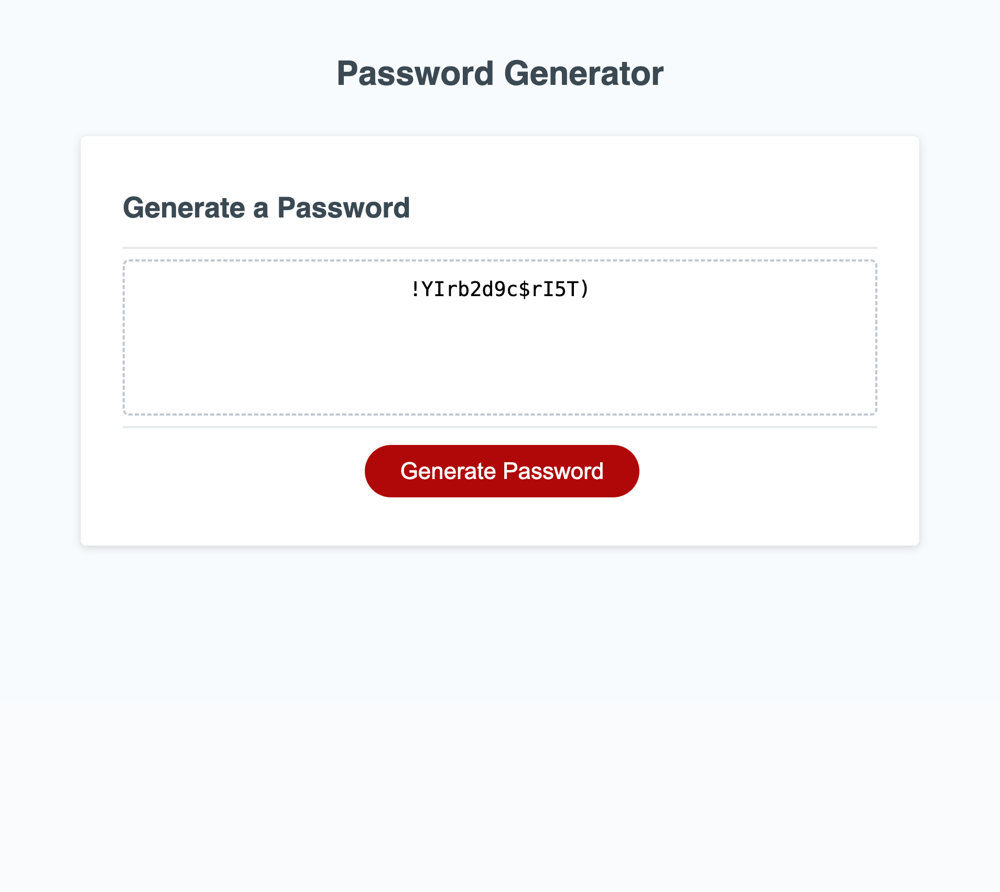

# PasswordGenerator
--Module 3 Challenge--
The purpose of this project was to implement all material that we have learned in class on JavaScript, to create a random password generator. All code for the project was written in the script.js file. The final version of the application allows users to generate a new password based off the criteria that they pick. Throughout the project, many javascript fundamentals were used, such as: query selectors, arrays, functions, if-statements, for loops, concaetenation, confirm methods, and prompts. 
Formulating the random password was a difficult challenge, which required research on how to do it. I used the webpage below as a reference on how to do it. 
[Random Password Generator using JavaScript](https://dev.to/code_mystery/random-password-generator-using-javascript-6a)

[application link](file:///Users/sandyvazquez/Desktop/module-3-challenge/index.html)

